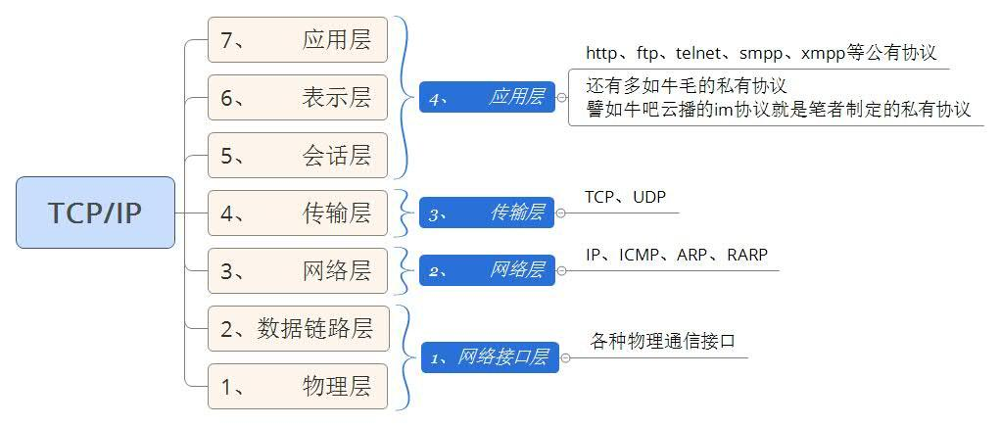
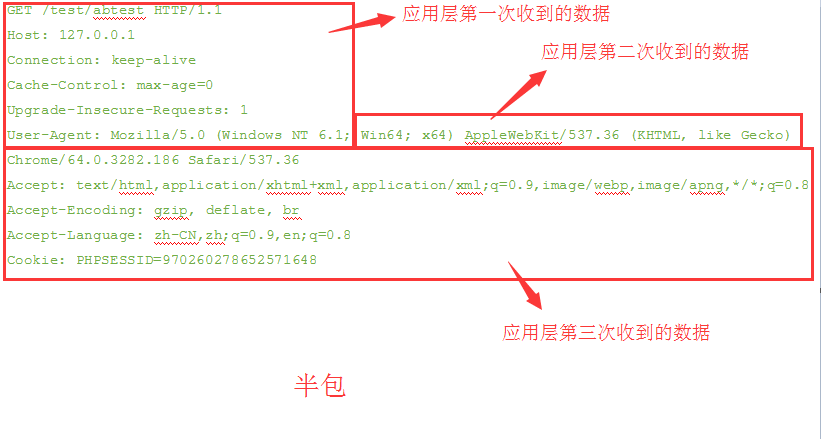
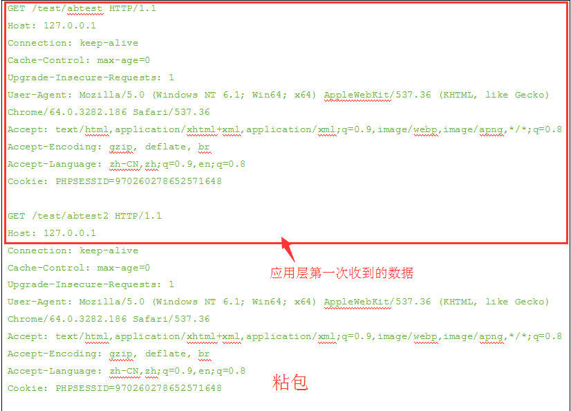
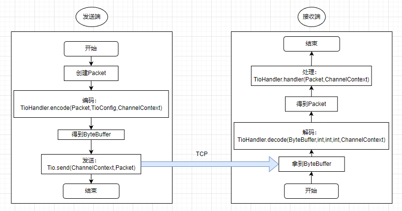
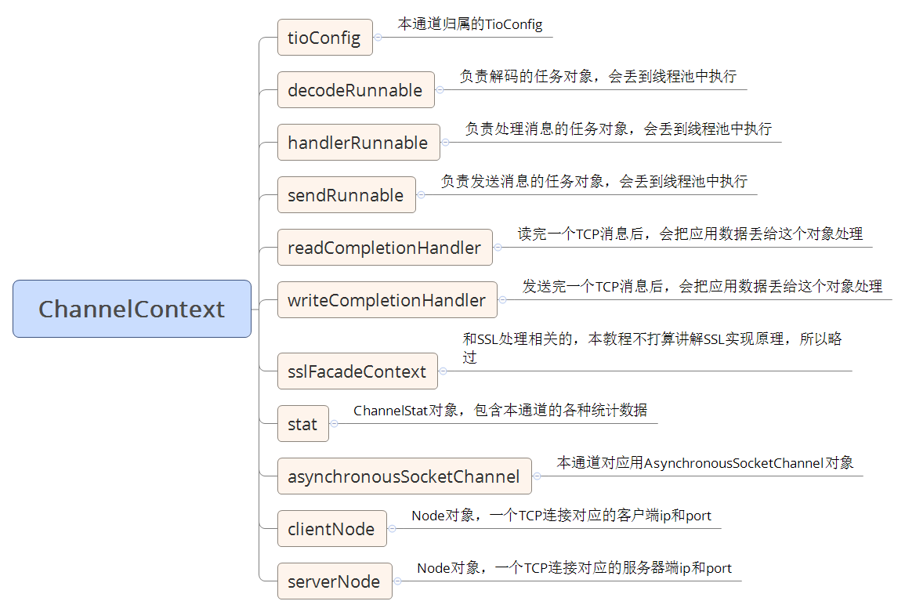
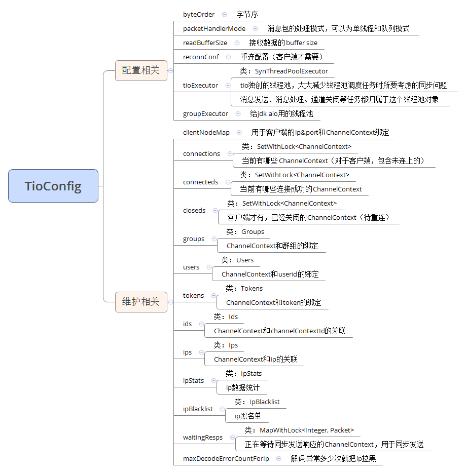
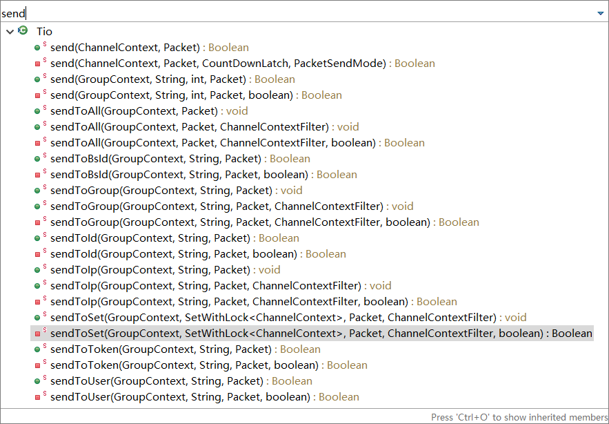
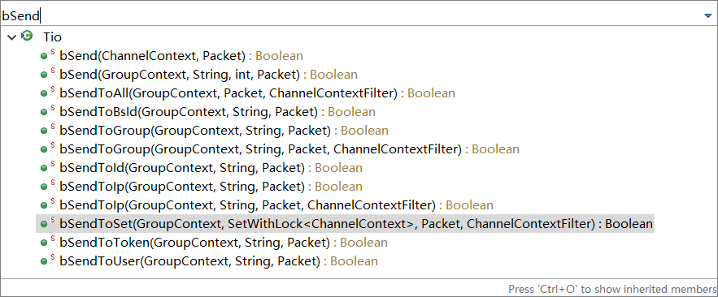

[网络编程很苦，用t-io后会很甜](https://gitee.com/tywo45/t-io)

- 极致打磨的底层集群能力，可无缝解决IM、物联网等大型产品的集群需求

- 易学易用，让刚毕业的大学生也能轻易驾驭

- 全方位开箱即用的监控能力

- 实战中仍表现出卓越的性能，不用实验室数据忽悠智慧的大众

- 内置协议适配能力，让多协议接入不再难

- 内置ack消息能力，让RPC等场景轻松实现

- 自创同步锁、同步安全线程池、同步数据结构等工具库，为业务应用提供丰富的开箱即用API

- 内置半包粘包处理

- 丰富的生态，目前已经用t-io实现了http、websocket、mqtt及大量私有协议

- 内置慢攻击防御机制，帮助应用自动拉黑嫌疑IP

- 1.9G内存稳定支持30万TCP长连接：[查看实测过程](https://www.tiocloud.com/61)

- t-io跑出每秒1051万条聊天消息：[查看实测过程](https://www.tiocloud.com/41)

- netty和t-io对比测试结果：[查看实测过程](https://www.tiocloud.com/154)

# 网络编程预备知识

## TCP/IP协议分层模型



### 应用层

- 你想用java写一个网络程序，你写的这个程序就是应用层

### 传输层

- 传输层只有TCP、UDP两种协议没有其他

- TCP协议的通信双方，需要知道彼此都在家呆着，且由客户端主动发起连接

- UDP协议，客户端知道服务器家住在哪，但并不知道服务器在不在家，扔条消息去服务器家，如果服务器不在家这条消息就被丢了

- 应用层把数据丢给传输层后，传输层把数据进行一下包装，包装纸上面写着“源端口、目的端口、序号、确认序号、检验和等TCP自身的数据”

- 传输层把数据给应用层时，会拆开对方的包装纸，应用层只看得到对方应用层发的数据

### 传输层数据是啥

- 就是应用层的数据带上一张包装纸后的数据

- 这层包装纸就是传输层的元数据或叫头部数据

- 为什么要带包装纸？因为要实名呀，现在快递都要实名了^_^

# ByteBuffer：网络编程前置技能

### 初识ByteBuffer

#### 常用属性

- byte[] bytes: 用来存储数据

- int capacity: 用来表示bytes的容量，那么可以想像capacity就等于bytes.size()，此值在初始化bytes后，是不可变的。

- int limit: 用来表示bytes实际装了多少数据，可以容易想像得到limit <= capacity，此值是可灵活变动的

- int position: 用来表示在哪个位置开始往bytes写数据或是读数据，此值是可灵活变动的

#### 常用方法

- ByteBuffer allocate(int capacity)：创建容量为xx的ByteBuffer对象

- put(byte b)：向ByteBuffer写入一个字节

- position()：获取当前位置

- position(int position)：设置读取位置，从头就是0

- byte get()：从当前position的位置读取一个字节的数据，读取后，position位置也会相应位移

# 半包和粘包：正确断句才能沟通

### 半包

收到了半个包，这个时候不足以组成一个应用层的包。这个半个包，并不是数据量的一半，而是表示没传传输完成的包。比如：你要对你喜欢的人说“我喜欢你”，但是因为喝水咽着了，第一次只说了“我”字，第二次说了个“喜”字，第三个次了个“欢你”，那么就发生了半包问题。

#### 用http协议为例，展示半包场景



### 粘包

粘包与半包相反，就是把多个想说的话，一口气说完了，对方反应不过来，得把你的话拆开一条一条地理解。

#### 用http协议为例，展示粘包场景



> 说明：http协议是一来一回的，所以正常场景是不会有粘包的，但pipeline模式下是允许一方连续发多个请求的，所以会有粘包产生

# 消息发送与接收流程



# t-io 常用组件

## 单条TCP连接上下文：ChannelContext

每一个tcp连接的建立都会产生一个ChannelContext对象，这是个抽象类，如果你是用t-io作tcp客户端，那么就是ClientChannelContext，如果你是用tio作tcp服务器，那么就是ServerChannelContext

### bind功能

绑定用户id和ChannelContext关联关系

```Java
Tio.bindUser(ChannelContext channelContext,String userId);
```

### 主要对象



## 服务配置与维护：TioConfig

- **场景**：我们在写TCP Server时，都会先选好一个端口以监听客户端连接，再创建N组线程池来执行相关的任务，譬如发送消息、解码数据包、处理数据包等任务，还要维护客户端连接的各种数据，为了和业务互动，还要把这些客户端连接和各种业务数据绑定起来，譬如把某个客户端绑定到一个群组，绑定到一个userid，绑定到一个token等。

- **TioConfig**就是解决以上场景的：配置线程池、监听端口，维护客户端各种数据等的。

- TioConfig是个抽象类，默认有TioClientConfig、TioServerConfig两个实现类，分别对应客户端配置、服务端配置

    - 一个监听端口对应一个ServerTioConfig ，一个jvm可以监听多个端口，所以一个jvm可以有多个ServerTioConfig对象

### 主要对象



### 如何获取TioConfig对象

#### 方法一：如果已经获取到ChannelContext对象

```Java
TioConfig tioConfig = channelContext.tioConfig;
```

#### 方法二：使用全局的静态变量

## 编码、解码、处理：TioHandler

TioHandler是处理消息的核心接口，它有两个子接口，ClientTioHandler和ServerTioHandler，当用tio作tcp客户端时需要实现ClientTioHandler，当用tio作tcp服务器时需要实现ServerTioHandler，它主要定义了3个方法，见下

### decode

根据ByteBuffer解码成业务需要的Packet对象.如果收到的数据不全，导致解码失败，请返回null，在下次消息来时框架层会自动续上前面的收到的数据

Packet decode (ByteBuffer buffer, int limit, int position, int readableLength, ChannelContext channelContext)

### encode

编码
ByteBuffer encode(Packet packet, TioConfig tioConfig, ChannelContext channelContext)

### handler

处理消息包
void handler(Packet packet, ChannelContext channelContext)

## 消息来往监听：TioListener

TioListener是处理消息的核心接口，它有两个子接口：ClientTioListener和ServerTioListener

- 当用tio作tcp客户端时需要实现ClientTioListener

- 当用tio作tcp服务器时需要实现ServerTioListener

主要是连接相关的监听事件，比如建链后触发的方法（onAfterConnected）、解码成功后触发的方法（onAfterDecoded）、接收到TCP层传过来的数据后（onAfterReceivedBytes）、消息包发送之后触发（onAfterSent）、处理一个消息包后（onAfterHandled）、连接关闭前触发（onBeforeClose）

## 服务器端入口：TioServer

服务器入口对象，主要使用的start方法启动t-io服务端。

```Java
void start(String serverIp, int serverPort)
```

## 客户端入口：TioClient

客户端入口对象，主要使用connect方法与服务端建立连接。

```Java
ClientChannelContext connect(Node serverNode)
```

## API集成 Tio

- 为了让用户减少查找API的时间，t-io把常用API以静态方法的形式汇集于一个类，这就是Tio.java

### 业务数据绑定

资源绑定是指把业务相关的数据和Tcp连接（即ChannelContext）关联起来

bindUser(ChannelContext channelContext, String userid)

### 业务数据解绑

资源解绑，把业务数据和Tcp连接解绑

unbindUser(ChannelContext channelContext)

### 数据发送

#### 异步发送

指的是业务层把Packet丢给t-io后立即返回，返回时Packet并没有被发送，而只是提交到了待发送队列。异步发送都是以send开头的



#### 阻塞发送

t-io把Packet送给对方后才返回，阻塞发送都是以bSend开头的



### 断开连接和移除连接

断开连接都是以close开头的方法，指的是把当前已经连上的TCP连接断开掉
移除连接都是以remove开头的方法，指的是彻底抛弃这个连接

- **如果是用t-io做TCP服务器端**

    - 上面两个方法是等价的，因为服务器不存在重连一说

- **如果是用t-io做TCP客户端，并且没有配置重连**

    - 上面两个方法也是等价的，因为不需要重连，tio断开连接后就会释放该连接全部资源

- **如果是用t-io做TCP客户端，并且配置了重连规则**，上面两个方法才是有区别的，区别如下

    - close()： 不释放相关资源，并且会进行重连

    - remove()：完全释放相关资源，不再进行重连

### t-io拉黑IP

```Java
Tio.IpBlacklist.add(tioConfig, channelContext.getClientNode().getIp());
```

## 数据监控

### 客户端IP数据监控 IpStat

可以监听到的数据：

- duration                    当前统计了多久，单位：毫秒

- durationType             时长类型，单位：秒，譬如60，3600等

- ip                               客户端ip

- decodeErrorCount    解码异常的次数

- requestCount            收到该IP连接请求的次数

- sentBytes                  本IP已发送的字节数

- sentPackets               本IP已发送的packet数

- handledBytes            本IP已处理的字节数

- handledPackets         本IP已处理的packet数

- handledPacketCosts  处理消息包耗时，单位：毫秒

- receivedBytes            本IP已接收的字节数

- receivedTcps              本IP已接收了多少次TCP数据包

- receivedPackets         本IP已接收的packet数

使用步骤 实现IpStatListener

- 初始化时添加监听器和监控时段

```Plain Text
//注意的是：要保证下面两行代码的顺序，不能先addDuration()后setIpStatListener
serverTioConfig.setIpStatListener(ShowcaseIpStatListener.me);
serverTioConfig.ipStats.addDuration(Time.MINUTE_1 * 5);
```

### 单条TCP连接的流量数据ChannelStat

一个TCP会话对应一个ChannelContext对象，每个ChannelContext对象都有一个ChannelStat对象，定义如下

```Java
public final ChannelStat stat = new ChannelStat();
```

主要字段：

- decodeFailCount                       本次解码失败的次数

- latestTimeOfReceivedPacket     最近一次收到业务消息包的时间(一个完整的业务消息包，一部分消息不算)

- latestTimeOfSentPacket             最近一次发送业务消息包的时间(一个完整的业务消息包，一部分消息不算)

- latestTimeOfReceivedByte         最近一次收到业务消息包的时间:收到字节就算

- latestTimeOfSentByte                近一次发送业务消息包的时间：发送字节就算

- timeCreated                               ChannelContext对象创建的时间

- timeFirstConnected                   第一次连接成功的时间

- timeClosed                                连接关闭的时间

- timeInReconnQueue                 进入重连队列时间

- sentBytes                                   本连接已发送的字节数

- sentPackets                               本连接已发送的packet数

- handledBytes                            本连接已处理的字节数

- handledPackets                         本连接已处理的packet数

- handledPacketCosts                  处理消息包耗时，单位：毫秒 拿这个值除以handledPackets，就是处理每个消息包的平均耗时

- receivedBytes                            本连接已接收的字节数

- receivedTcps                             本连接已接收了多少次TCP数据包

- receivedPackets                        本连接已接收的packet数

- double getBytesPerTcpReceive()  平均每次TCP接收到的字节数，这个可以用来监控慢攻击，配置PacketsPerTcpReceive定位慢攻击

- double getPacketsPerTcpReceive() 平均每次TCP接收到的业务包数，这个可以用来监控慢攻击，此值越小越有攻击嫌疑

- double getHandledCostsPerPacket()  处理packet平均耗时，单位：毫秒

## 带读写锁的对象：ObjWithLock

网络编程中会伴随大量并发操作，大家对ConcurrentModificationException一定不会陌生，这个是典型的并发操作集合引发的异常。为了更好的处理并发，tio自创了一个ObjWithLock对象，这个对象很简单，但给并发编程带来了极大的方便，如果您阅读过tio源代码，相信已经体会到这个对象在tio中是无处不在的。ObjWithLock顾名思义，它就是一个自带了一把（读写）锁的普通对象（一般是集合对象），每当要对这个对象进行同步安全操作（并发下对集合进行遍历或对集合对象进行元素修改删除增加）时，就得用这个锁。

# tio-demo helloworld版本的入门项目

## 创建tio-demo maven项目

### 增加pom依赖

```XML
        <dependency>
            <groupId>org.t-io</groupId>
            <artifactId>tio-core</artifactId>
            <version>3.8.3.v20220902-RELEASE</version>
        </dependency>

        <dependency>
            <groupId>org.projectlombok</groupId>
            <artifactId>lombok</artifactId>
            <version>1.18.24</version>
            <scope>provided</scope>
        </dependency>

        <dependency>
            <groupId>cn.hutool</groupId>
            <artifactId>hutool-all</artifactId>
            <version>5.8.9</version>
        </dependency>

        <!-- 打印日志 -->
        <!-- 添加slf4j日志api -->
        <dependency>
            <groupId>org.slf4j</groupId>
            <artifactId>slf4j-api</artifactId>
            <version>1.7.20</version>
        </dependency>
        <!-- 添加logback-classic依赖 -->
        <dependency>
            <groupId>ch.qos.logback</groupId>
            <artifactId>logback-classic</artifactId>
            <version>1.2.3</version>
        </dependency>
        <!-- 添加logback-core依赖 -->
        <dependency>
            <groupId>ch.qos.logback</groupId>
            <artifactId>logback-core</artifactId>
            <version>1.2.3</version>
        </dependency>
```

### 增加logback.xml 日志配置，放置到/src/main/resources下面

```XML
<?xml version="1.0"?>
<configuration>

    <!-- ch.qos.logback.core.ConsoleAppender 控制台输出 -->
    <appender name="console" class="ch.qos.logback.core.ConsoleAppender">
        <encoder>
            <pattern>[%-5level] %d{HH:mm:ss.SSS} [%thread] %logger{36} - %msg%n</pattern>
        </encoder>
    </appender>

    <!-- 日志级别 -->
    <root>
        <level value="info" />
        <appender-ref ref="console" />
    </root>
</configuration>
```

### 继承Packet，自定义BasePacket作为数据传输基础对象

```Java
@Data
public class BasePacket extends Packet {

    /**
     * 消息头的长度 1+4
     * 指令类型 + 消息长度
     */
    public static final int HEADER_LENGTH = 5;

    /**
     * 编码格式
     */
    public static final String CHARSET = "utf-8";

    /**
     * 指令类型
     */
    private byte type;

    /**
     * 消息内容
     */
    private byte[] body;
}
```

### 创建常量配置Const

```Java
public interface Const {
    /**
     * 心跳超时时间 单位毫秒
     */
    public static final int TIMEOUT = 60 * 1000;
}
```

### 定义消息类型 PacketType

```Java
public interface PacketType {
    /**
     * 文本消息
     */
    byte TEXT_REQ = 1;

    /**
     * 文件消息
     */
    byte FILE_REQ = 2;

    /**
     * 心跳
     */
    byte HEART_BEAT = 99;
}
```

### 增加抽象类 BaseHandler，实现TioHandler接口，完成自定义消息加解密功能

```Java
@Slf4j
public abstract class BaseHandler implements TioHandler {

    @Override
    public BasePacket decode(ByteBuffer byteBuffer, int limit, int position, int readableLength, ChannelContext channelContext) throws TioDecodeException {
        if(readableLength < BasePacket.HEADER_LENGTH){
            // 可读数据小于头固定长度
            log.debug("tio解码失败,可读数据小于头固定长度,头:{},可读数据:{}",BasePacket.HEADER_LENGTH,readableLength);
            return null;
        }

        //消息类型
        byte type = byteBuffer.get();
        //读取消息体的长度
        int bodyLength = byteBuffer.getInt();
        //数据不正确，则抛出TioDecodeException异常
        if (bodyLength < 0) {
            throw new TioDecodeException("bodyLength [" + bodyLength + "] is not right, remote:" + channelContext.getClientNode());
        }

        //计算本次需要的数据长度
        int neededLength = BasePacket.HEADER_LENGTH + bodyLength;
        if (readableLength < neededLength){
            // 不够消息体长度(剩下的buffe组不了消息体)
			log.debug("tio解码失败,不够消息体长度,需读数据:{},可读数据:{}",neededLength,readableLength);
            return null;
        } else {
            BasePacket basePacket = new BasePacket();
            basePacket.setType(type);
            if (bodyLength > 0) {
                byte[] bytes = new byte[bodyLength];
                byteBuffer.get(bytes);
                basePacket.setBody(bytes);
            }
            return basePacket;
        }
    }

    @Override
    public ByteBuffer encode(Packet packet, TioConfig tioConfig, ChannelContext channelContext) {
        BasePacket basePacket = (BasePacket) packet;

        byte type = basePacket.getType();
        byte[] body = basePacket.getBody();
        int bodyLen = 0;
        if(null != body){
            bodyLen = body.length;
        }

        // 总长度是消息头的长度+消息体的长度
        int allLen = BasePacket.HEADER_LENGTH + bodyLen;

        ByteBuffer buffer = ByteBuffer.allocate(allLen);
        // 设置字节序
        buffer.order(tioConfig.getByteOrder());

        // 写入消息类型
        buffer.put(type);
        // 写入消息体长度
        buffer.putInt(bodyLen);
        // 写入消息体
        if(null != body){
            buffer.put(body);
        }
        return buffer;
    }
}
```

### 编写服务端消息处理类ServerHandler 

继承BaseHandler并实现TioServerHandler

```Java
@Slf4j
public class ServerHandler extends BaseHandler implements TioServerHandler {
    @Override
    public void handler(Packet packet, ChannelContext channelContext) throws Exception {
        BasePacket basePacket = (BasePacket) packet;
        byte[] body = basePacket.getBody();
        if(null != body){
            String msg = new String(body);
            log.info("收到消息：{}", msg);

            // 给客户端发消息
            String returnMsg = "我收到 你的消息了:" + msg;
            basePacket.setBody(returnMsg.getBytes());
            Tio.send(channelContext, basePacket);
        }
    }
}
```

### 创建服务器启动类

```Java
public class TioServerApp {
    // handler, 包括编码、解码、消息处理
    private static TioServerHandler tioServerHandler = new ServerHandler();
    // 事件监听器，可以为null，但建议自己实现该接口
    private static TioServerListener tioServerListener = null;
    // 一组连接共用的上下文对象
    private static TioServerConfig serverConfig = new TioServerConfig("tio-server",tioServerHandler,tioServerListener);
    // tioServer对象
    private static TioServer tioServer = new TioServer(serverConfig);

    public static void main(String[] args) {
        try {
            tioServer.start("127.0.0.1",8888);
        } catch (IOException e) {
            throw new RuntimeException(e);
        }
    }
}
```

### 编写客户端消息处理类ClientHandler 

继承BaseHandler并实现TioClientHandler

```Java
@Slf4j
public class ClientHandler extends BaseHandler implements TioClientHandler {
    @Override
    public void handler(Packet packet, ChannelContext channelContext) throws Exception {
        BasePacket basePacket = (BasePacket) packet;
        log.info("收到消息：{}" ,new String(basePacket.getBody()));
    }

    /**
     * 此方法如果返回null，框架层面则不会发心跳；如果返回非null，框架层面会定时发本方法返回的消息包
     * @param channelContext
     * @return
     */
    @Override
    public Packet heartbeatPacket(ChannelContext channelContext) {
        BasePacket basePacket = new BasePacket();
        basePacket.setType((byte) 99);
        return basePacket;
    }
}
```

### 创建客户端启动类

```Java
public class TioClientApp {
    // 服务器节点
    private static Node node = new Node("127.0.0.1",8888);
    // handler, 包括编码、解码、消息处理
    private static TioClientHandler tioClientHandler = new ClientHandler();
    // 事件监听器，可以为null，但建议自己实现该接口
    private static TioClientListener tioClientListener = null;
    // 断链后自动连接的，不想自动连接请设为null
    private static ReconnConf reconnConf = new ReconnConf(5000);
    // 一组连接共用的上下文对象
    private static TioClientConfig tioClientConfig = new TioClientConfig(tioClientHandler,tioClientListener,reconnConf);

    public static TioClient tioClient = null;

    public static ClientChannelContext clientChannelContext = null;

    public static void main(String[] args) {
        try {
            // 设置心跳超时时间
            tioClientConfig.setHeartbeatTimeout(Const.TIMEOUT);
            tioClient = new TioClient(tioClientConfig);
            clientChannelContext = tioClient.connect(node);
            // 发条消息玩玩
            sendMsg();
        } catch (Exception e) {
            e.printStackTrace();
        }
    }

    public static void sendMsg(){
        BasePacket basePacket = new BasePacket();
        basePacket.setType((byte)1);
        basePacket.setBody(new String("hello tio").getBytes());
        Tio.send(clientChannelContext,basePacket);
    }
}
```

### 测试

上面的功能，完成了一个客户端连接服务端后，并发送一条“hello tio” 消息给服务端，服务端收到后，再回给客户端的功能。

```Plain Text
[INFO ] 11:35:14.712 [main] org.tio.server.TioServer - 
|----------------------------------------------------------------------------------------|
| t-io site         | https://www.tiocloud.com                                           |
| t-io on gitee     | https://gitee.com/tywo45/t-io                                      |
| t-io on github    | https://github.com/tywo45/t-io                                     |
| t-io version      | 3.8.3.v20220902-RELEASE                                            |
| ---------------------------------------------------------------------------------------|
| TioConfig name    | tio-server                                                         |
| Started at        | 2023-04-27 11:35:14                                                |
| Listen on         | 127.0.0.1:8888                                                     |
| Main Class        | top.javajianghu.tio.learn.server.TioServerApp                      |
| Jvm start time    | 314ms                                                              |
| Tio start time    | 29ms                                                               |
| Pid               | 16404                                                              |
|----------------------------------------------------------------------------------------|

[INFO ] 11:35:26.914 [tio-group-3] t.j.tio.learn.server.ServerHandler - 收到消息：hello tio
```

```Plain Text
[INFO ] 11:35:26.813 [tio-timer-heartbeat1] org.tio.client.TioClient - [1]: curr:0, closed:0, received:(0p)(0b), handled:0, sent:(0p)(0b)
[INFO ] 11:35:26.911 [tio-group-2] o.t.c.ConnectionCompletionHandler - connected to 127.0.0.1:8888
[INFO ] 11:35:26.918 [tio-group-4] t.j.tio.learn.client.ClientHandler - 收到消息：我收到 你的消息了:hello tio
```


